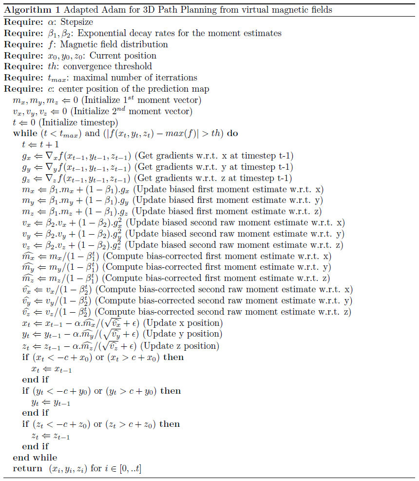
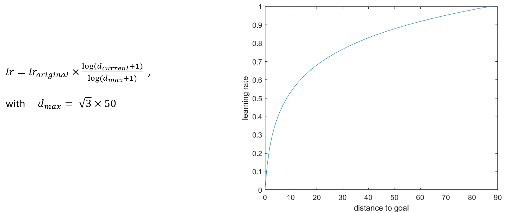
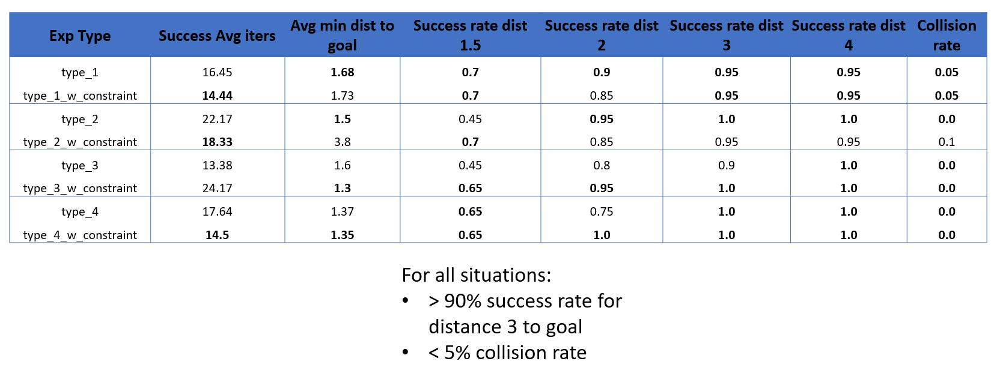

# Deep_Planning_3D

### 1) Data Generation
* magnetic field easily simulated 
* large dataset of 3D: conductivity maps and corresponding 3D magnetic field distributions
* 2 data generation steps: 
  - generation of a random configuration of the scene 
  - simulation of Maxwell’s equations.
  
#### Scene Building
* Scene: a 10mx10mx10m cube 
* Goal: 
  - sphere with radius=0.09m. 
  - Coordinates randomly generated in [1, 9] 
* Obstacles:
  - number: random integer in [0, 10] 
  - shapes: randomly chosen from: cube, cuboide, T, L and U shaped. 
  - Coordinates: randomly generated in [1, 9] 
  - offsets: randomly generated in [0.3, 2.7]

#### Magnetic Field Simulation
Conductivity computation:
  - inside the obstacles: constant conductivity of 𝜎o=0
  - inside the goal: constant conductivity of 𝜎g=1e6
  - remaining points: 
  

    
  

solve Helmholtz differential equation:

  

 
 

  

### 2) Data Preprocessing

The aim of this step is to prepare the output of the finite element simulation to be the input of the network. 
For each generated sample, the output of the simulation consists of scene information and the magnetic field magnitudes, saved as text files. 

The magnetic field file consists of three columns for (𝑥,𝑦,𝑧) coordinates, a column for radius which represents the radius of the volume scatter 
and is not relevant, and the color column which contains the magnitudes of the magnetic fields. The offset parameter of the volume scatter was 
set to 0.1 which means that 101x101x101=1030301 values can be maximally generated. 
Values can only be generated in the free space (not inside obstacles). Therefore, the number of generated values is always smaller than 1030301 
and the values inside the obstacles must be added during this preprocessing step. To avoid the noise in x,y and z columns, these three columns were 
rounded to one decimal place. All rows were then sorted w.r.t the coordinates. 

For each (𝑥𝑖,𝑦𝑖,𝑧𝑖) and using the position of the goal from the scene configuration, the conductivity was computed following the same method in the 
simulation. In the missing positions, the conductivities was set to 𝜎𝑜, as they represent the positions inside the obstacles. One added step to the 
simulation is that all the conductivities were normalized between 0 and 1000, using a min-max normalization. For the labels, the labels of the missing 
positions were set to 0, if all the labels were positive and to the minimum of all the labels, if not. After that all the labels were normalized between 
0 and 1000, using a min-max normalization. Each sample (input and ground truth) was saved as a Numpy array with size (101x101x101x2) 

  

### 3) CNN Training
* neural network: supervised pixel-wise regression model 
* Input: conductivity data 
* Output: magnetic distributions 
* encoder-decoder architecture
  * 3D convolution layers and 3D Max Pooling for the encoding 
  * transposed 3D convolutions for the decoding
* ReLu as Activation followed by Batch Normalization and Dropout
* L2 regularization applied to all convolutions
* Adam optimizer with mean squared logarithmic error as a loss function
* maximal number of epochs was set to 1000 epochs
* Early Stopping with patience of 50 epochs on the validation loss
* initial learning rate of 1e-3 with reducer on plateau with patience of 20 epochs with a reduction factor of 0.75 and learning rate minimum of 3e-5.
* Batch size of 12

  

  

### 4) Path Planning
* in-the-loop
* each iteration:
  - 3D point cloud of the obstacles
  - goal transformed to the local coordinates
  - 101x101x101 conductivity map constructed as in the data generation step robot position in this map set to (50,50,50)
  - conductivity map processed by the 3D CNN to predict the magnetic field distribution
  - path computed in the 101x101x101 surrounding map using the adapted Adam algorithm
 

  

  

### 5) Experiments
Random experiments were generated with 4 different types.
The environment size, the obstacles' and goal's positions are randomly selected based on the experiment type.

  

#### results
The result of one experiment would look like this:

  

  

